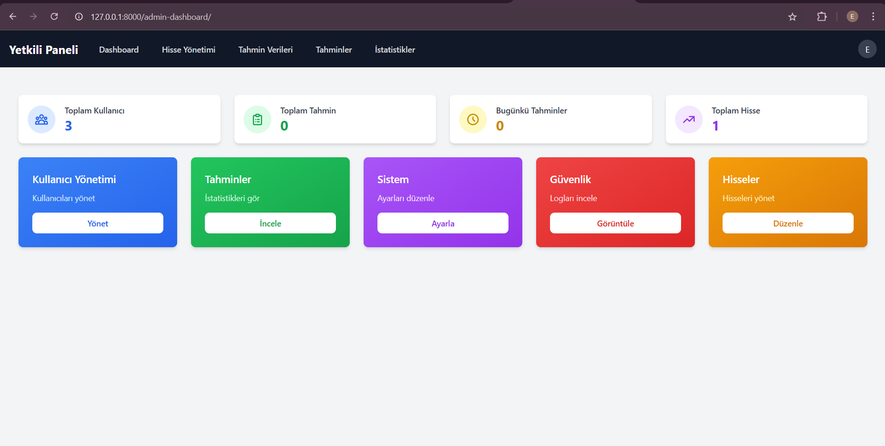
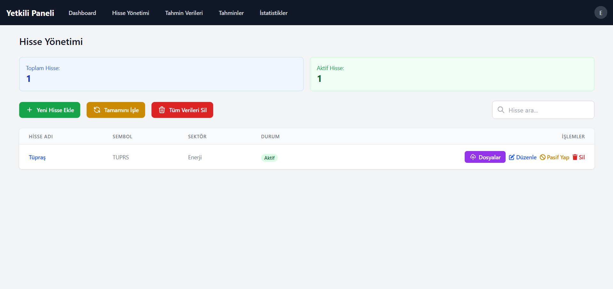
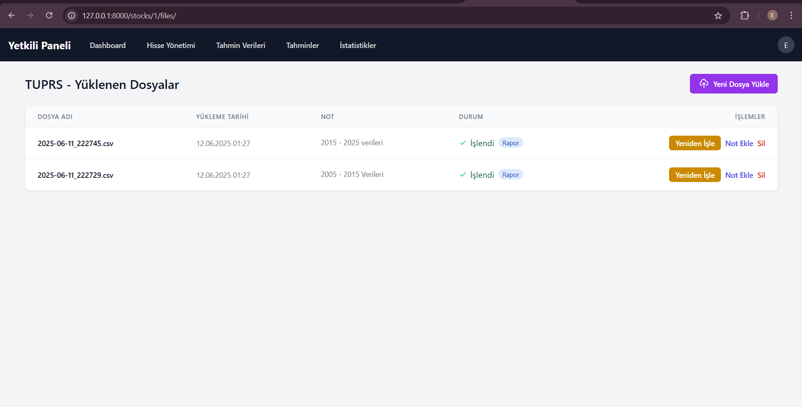
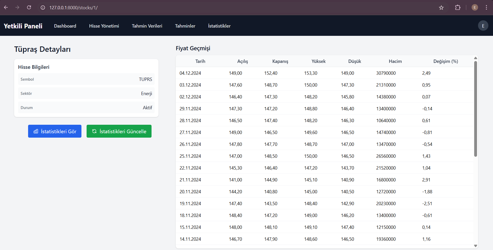
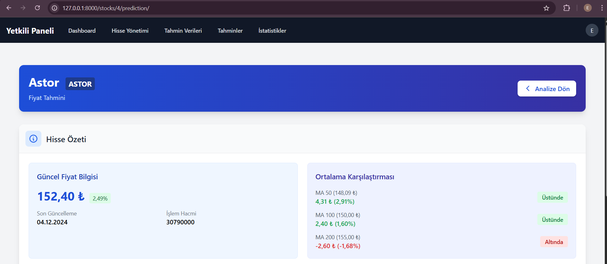
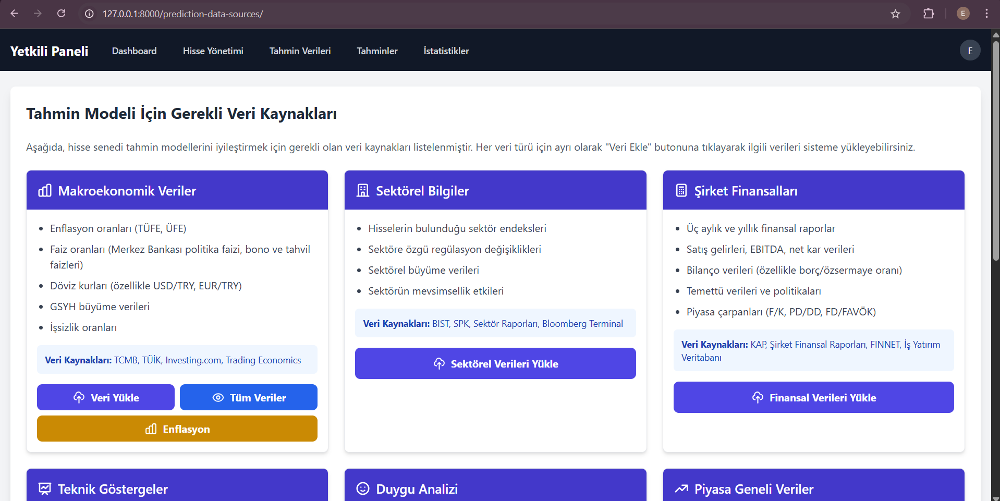

# Hisse Tahmin Projesi 


Bu proje, Borsa İstanbul'da işlem gören hisse senetlerinin fiyat tahminlerini yapmak için geliştirilmiş kapsamlı bir web uygulamasıdır. Makine öğrenmesi algoritmaları kullanarak, teknik ve temel analiz verilerini birleştirerek tahminler üretir.

##  Özellikler

###  Veri Analizi ve Tahmin


- **Kapsamlı Veri Analizi**
  - Teknik analiz göstergeleri (RSI, MACD, Bollinger Bantları vb.)
  - Temel analiz verileri (Finansal tablolar, oranlar)
  - Makroekonomik veriler (Enflasyon, faiz oranları, döviz kurları)
  - Sektörel analizler ve regülasyonlar

###  Tahmin Modeli


- **Gelişmiş Tahmin Modeli**
  - Makine öğrenmesi tabanlı tahmin algoritmaları
  - Çoklu veri kaynağı entegrasyonu
  - Otomatik model güncelleme ve optimizasyon

###  Kullanıcı Arayüzü


- **Kullanıcı Yönetimi**
  - Güvenli kullanıcı kimlik doğrulama
  - Rol tabanlı yetkilendirme (Admin/Kullanıcı)
  - Kişiselleştirilmiş dashboard

###  Veri Yönetimi


- **Veri Yönetimi**
  - Excel ve PDF dosyalarından otomatik veri çekme
  - Toplu veri işleme ve analiz
  - Detaylı raporlama ve görselleştirme

##  Teknolojiler


- **Backend**
  - Django 5.1.7
  - PostgreSQL
  - Python 3.x

- **Veri İşleme**
  - Pandas
  - NumPy
  - Scikit-learn

- **Frontend**
  - HTML5
  - CSS3
  - JavaScript
  - Bootstrap
 
# Proje görselleri
## 1-) Admin Ekranı
    admin yetkisi olan kullanıcı buradan sayfadaki genel ayarları kolaylıkla yönetebiliyor ve gözlemleyebiliyor.    

   
## 2-) Hisse Senedi İşlemleri
    bu kısımda kullanıcı hisse ekleyebiliyor, silebiliyor ve güncelleyebiliyor
  

## 3-) Hisse verilerini yükleme, Veritabanına kaydetme
    Kullanıcı ilgili hisse senedinin geçmiş fiyat verilerini dosya olarak yükleyebilir, bu verileri 'İşle' butonu ile veritabanına kaydedebilir ve yüklediği dosya hakkında bir not bırakabilir
  
  
## 4-) Hisse Senedi Verilerini kullanarak hesaplamalar yapmak, Bazı verileri kullanıcıya göstermek
    İlgili hisse senedinin önemli hareketli ortalamaları hesaplanarak kaydediliyor.
  

## 5-) Hisse Hakkında bir tahmin modeli Seçerek tahmin işlemi başlatma, Önemli hareketli ortalamaları gösterme
  
  

## 6-) Tahmin Modelinde Kullanılacak detaylı bilgiler için kapsamlı bir bilgi toplama sayfası
  

## 🚀 Kurulum


1. Projeyi klonlayın:
```bash
git clone https://github.com/kullaniciadi/hisse-tahmin.git
cd hisse-tahmin
```

2. Sanal ortam oluşturun ve aktifleştirin:
```bash
python -m venv venv
source venv/bin/activate  # Linux/Mac
venv\Scripts\activate     # Windows
```

3. Gerekli paketleri yükleyin:
```bash
pip install -r requirements.txt
```

4. `.env` dosyasını oluşturun:
```env
DJANGO_SECRET_KEY=your-secret-key
DJANGO_DEBUG=True
DB_NAME=hisse_tahmin
DB_USER=your-db-user
DB_PASSWORD=your-db-password
DB_HOST=localhost
DB_PORT=5432
```

5. Veritabanı migrasyonlarını uygulayın:
```bash
python manage.py migrate
```

6. Süper kullanıcı oluşturun:
```bash
python manage.py createsuperuser
```

7. Geliştirme sunucusunu başlatın:
```bash
python manage.py runserver
```

##  Veri Kaynakları


- Borsa İstanbul (BIST)
- Türkiye İstatistik Kurumu (TÜİK)
- Merkez Bankası (TCMB)
- Şirket Finansal Raporları

## 🔒 Güvenlik


- Hassas bilgiler `.env` dosyasında saklanır
- Kullanıcı şifreleri güvenli bir şekilde hashlenir
- CSRF ve XSS koruması
- Rol tabanlı erişim kontrolü

## 🤝 Katkıda Bulunma


1. Bu depoyu fork edin
2. Yeni bir branch oluşturun (`git checkout -b feature/amazing-feature`)
3. Değişikliklerinizi commit edin (`git commit -m 'Add some amazing feature'`)
4. Branch'inizi push edin (`git push origin feature/amazing-feature`)
5. Pull Request oluşturun

## 📝 Lisans

Bu proje MIT lisansı altında lisanslanmıştır. Detaylar için [LICENSE](LICENSE) dosyasına bakın.

## 📞 İletişim

Sorularınız veya önerileriniz için: [erdaltasar24@gmail.com](mailto:erdaltasar24@gmail.com)

---

⭐ Bu projeyi beğendiyseniz, yıldız vermeyi unutmayın! ⭐
